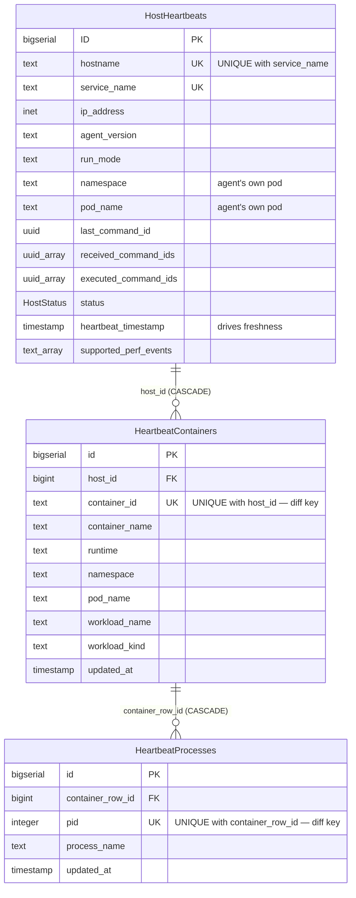
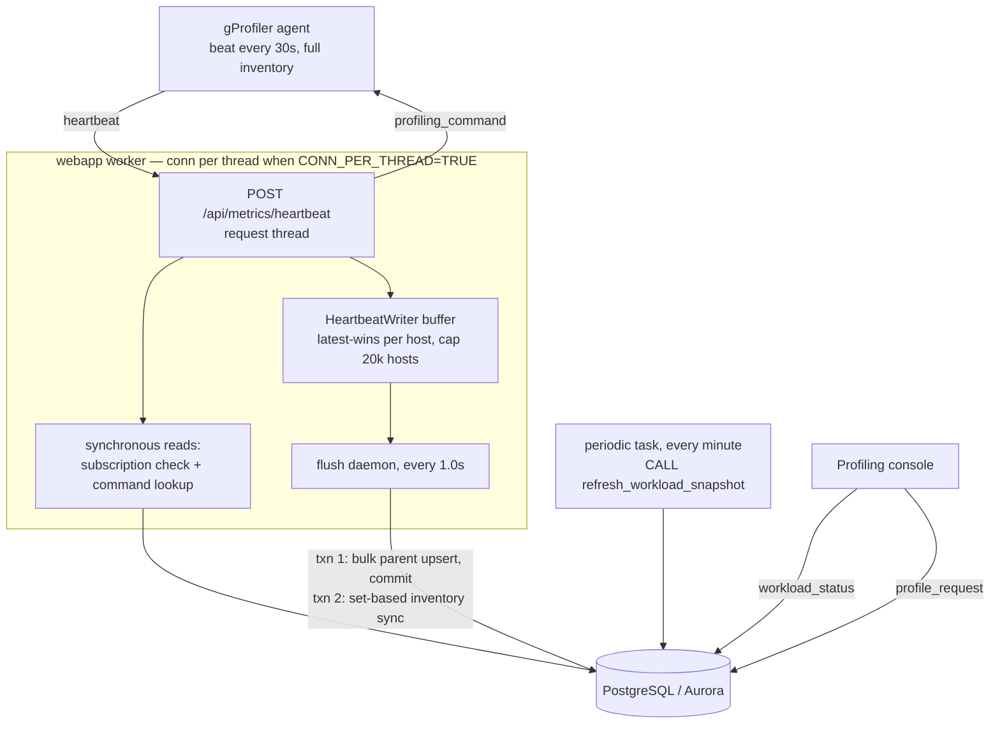

# Workload-Level Profiling Spec for Performance Studio

## Purpose

This spec defines the backend and UI design for workload-level profiling in
Performance Studio. It also serves as the source-of-truth document for
spec-driven development of future workload-selection and heartbeat-inventory
changes in this repo.

The design extends the existing heartbeat control plane rather than replacing
it: the backend stores workload inventory from agent heartbeats, exposes
workload-aware status views, and resolves workload selections into host/PID
commands before dispatch.

## Problem Statement

The existing dynamic profiling flow is host-centric:

- the UI shows one row per host
- requests target `target_hosts`
- the backend persists host heartbeats and host commands
- the agent receives commands by host/service

This is insufficient for Kubernetes-heavy deployments where users want to start
profiling from the level they reason about operationally:

- namespace
- workload
- pod
- container
- process

## Motivation

Before this work, Performance Studio only supported **host-level** profiling:
the user picked individual hosts and profiling commands were issued per host.
Workload-level profiling exists to address two concrete operational pain points.

### 1. Cluster churn breaks host-pinned profiling

Hosts are constantly removed from and added to a cluster (autoscaling, spot
reclamation, rolling replacements). With host-pinned selection, every time the
fleet changes the user has to return to the UI and re-select hosts, and any
host added after the original selection is simply **not profiled**.

Workload-level profiling fixes this by letting the user select an entire
**service** (and, in future, broader scopes). When a service is selected for
continuous profiling, the selection is treated as a durable **subscription**:
as new hosts for that service register via heartbeat, they are **immediately
and automatically enrolled** in profiling — no manual re-selection. See
[Continuous Service Subscriptions & Auto-Enrollment](#continuous-service-subscriptions--auto-enrollment).

### 2. Users often want a specific process/container/pod, not whole hosts

A host can run many workloads, but the user frequently cares about one
container, pod, or process (e.g. a single Java service in a shared node). Whole-
host profiling is both noisier and more expensive than necessary.

Workload-level profiling lets the user target the precise scope they reason
about (`namespace`, `workload`, `pod`, `container`, `process`) and the backend
resolves that selection down to the exact `hostname -> [pid, ...]` mapping the
agent executes. See [Control path](#control-path).

## Goals

1. Add workload-aware inventory without breaking the current heartbeat protocol.
2. Keep command dispatch backward compatible with host-based agent execution.
3. Let the UI present workload tabs and workload-aware confirmation summaries.
4. Create a spec that future work can evolve first, before code changes.

## Non-Goals

- redesigning profiling commands around pod-native execution
- adding a brand-new command queue model
- guaranteeing globally stable Kubernetes workload IDs in v1
- solving historical inventory retention beyond current heartbeat freshness

## Design Principles

- **Additive schema changes only** for heartbeat inventory fields.
- **Backend resolution, agent execution**: workload targeting resolves to
  host/PID mappings in the backend.
- **Best-effort metadata**: missing namespace/pod/container fields must not
  break host-level behavior.
- **Freshness over history**: UI tabs represent active inventory from recent
  heartbeats.

## Data Model

Workload inventory is normalized across three tables with cascading deletes,
keyed so that an unchanged inventory produces zero row writes.



### Keys and indexes

| Table | Uniqueness | Indexes |
|---|---|---|
| `HostHeartbeats` | `(hostname, service_name)` | `hostname`, `service_name`, `status`, `heartbeat_timestamp`, `namespace`, `pod_name` |
| `HeartbeatContainers` | `(host_id, container_id)` | `host_id`, `namespace`, `pod_name`, `workload_name` |
| `HeartbeatProcesses` | `(container_row_id, pid)` | `container_row_id`, `process_name` |

The two child uniqueness constraints are the **diff keys**: the write path
upserts on them and rewrites a row only when a value actually changed.

All three id sequences are set to `CACHE 500`. `INSERT … ON CONFLICT` evaluates
the id `DEFAULT` (`nextval`) for every *proposed* row before resolving the
conflict, so at fleet beat rates a naive blanket upsert allocates sequence
values for rows that are never inserted. The write path avoids that by filtering
to genuinely-new rows (see [Ingest Path](#ingest-path)); the larger cache is a
complementary safety margin for the remaining real inserts.

Only containerized workloads are stored. The agent reports an empty list for
hosts with no container runtime, entries without a `container_id` are skipped
because they cannot be diffed, and processes not mapped to a container are
covered by host-scope profiling instead.

An earlier transitional `containers jsonb` column on `HostHeartbeats` has been
dropped in favor of the normalized tables.

### Command tables

`ProfilingRequests` remains API-level intent storage. Workload selectors are
stored in `additional_args` as part of the request contract so the existing
table does not need a full relational redesign in v1. It is also the source of
truth for continuous service subscriptions.

`ProfilingCommands` holds per-host dispatch state under
`UNIQUE (hostname, service_name)`, so a host has exactly one current command.
`request_ids uuid[]` links back to the requests merged into it and
`combined_config jsonb` carries the effective profiler configuration — including
the PIDs a workload selection resolved to.

`ProfilingExecutions` is the audit trail, keyed `UNIQUE (command_id, hostname)`.

### Precomputed workload-status store

Read-side denormalization for `GET /profiling/workload_status`, maintained by a
periodic job rather than on the request path.

| Object | Purpose |
|---|---|
| `workload_snapshot_meta` | Singleton: `active_generation`, `built_at`, `build_duration_ms` |
| `workload_tab_counts_0` / `_1` | The six scope tab counts plus active-host count |
| `workload_scope_summary_0` / `_1` | Precomputed grouped rows for coarse scopes |
| `workload_snapshot_0` / `_1` | Denormalized host × container × process flatten — **defined but not currently populated or read** |
| `workload_snapshot`, `workload_scope_summary`, `workload_tab_counts` | The views readers query; re-pointed on each swap |

Each object has two physical generations. `refresh_workload_snapshot()` rebuilds
the inactive generation, then re-points the views and flips
`workload_snapshot_meta` **in one transaction**, so a reader never observes a
partial build and the rebuild never blocks reads.

Layer 1 (`workload_snapshot`) was designed to serve *filtered* reads from an
indexed flatten. It is currently not built — dropping it took the rebuild from
roughly 18 minutes to about 1 minute — and filtered reads use the live path
instead. Reintroduce an optimized snapshot build when the
filtered-read-from-snapshot path is implemented.

## API Contract

### Heartbeat Ingress

The existing `POST /api/metrics/heartbeat` endpoint now accepts optional
workload inventory fields:

```json
{
  "hostname": "node-a",
  "service_name": "checkout",
  "namespace": "observability",
  "pod_name": "gprofiler-abcde",
  "agent_version": "1.2.3",
  "run_mode": "k8s",
  "perf_supported_events": ["cycles", "instructions"],
  "containers": [
    {
      "container_id": "abc123",
      "container_name": "checkout",
      "runtime": "containerd",
      "namespace": "shop",
      "pod_name": "checkout-7f8d9cb4d-x2m9q",
      "workload_name": "checkout",
      "workload_kind": "Deployment",
      "processes": [
        { "pid": 1234, "process_name": "java" }
      ]
    }
  ]
}
```

The agent sends its **complete** inventory on every beat, never a delta, and
holds no knowledge of what the backend has stored. Diffing is therefore a
backend responsibility — see [Ingest Path](#ingest-path). Entries without a
`container_id` are dropped because that column is the diff key.

### Profiling Request Ingress

The request contract is extended with:

- `target_scope`
- `target_entities`
- optional `target_hosts` for pure host targeting

Supported `target_scope` values:

- `host`
- `service`
- `namespace`
- `workload`
- `pod`
- `container`
- `process`

Each entry in `target_entities` may include service/namespace/host/pod/container
and process selectors.

> **Known asymmetry:** `workload` is accepted as a `target_scope` but is not one
> of the `workload_status` scopes, so there is no workload tab in the UI to
> originate such a selection from. Either add the scope to the status view or
> drop it from the request contract.

## Architecture

Three loosely coupled paths share the inventory tables. The unifying invariant
is that **the agent's execution model stays host-and-PID based** — all workload
awareness lives in the backend.



### Ingest path

The request thread does only fast work: the two synchronous reads it must answer
now (subscription check and command lookup), then it enqueues the host and
inventory payload and returns. The heavy write never touches the request thread.

`HeartbeatWriter` buffers payloads keyed by `(hostname, service_name)` with
**latest-wins** semantics, so repeated beats within a flush window collapse to
one write and the working set is bounded by active hosts rather than request
rate. The buffer is capped; dropping on overflow is safe because the host
re-sends on its next beat.

A daemon thread flushes every second through `bulk_upsert_host_heartbeats`,
which runs **two short transactions**:

1. **Parent upsert** — one bulk `execute_values` `INSERT … ON CONFLICT` over
   every host in the batch, returning row ids, committed on its own so the hot
   rows that every freshness query reads are locked for milliseconds rather than
   minutes.
2. **Inventory sync** — set-based prune, insert-only-new, and update-only-changed
   statements spanning the whole batch for both containers and processes: a
   fixed handful of round-trips regardless of host count.

Both carry a bounded deadlock retry. If inventory cannot land after retries it
is skipped rather than failing the flush — freshness is already committed and
inventory re-syncs on the next beat.

Two invariants make this survivable at fleet scale:

- **Unchanged inventory writes zero rows.** Inserts are filtered by
  `WHERE NOT EXISTS` and updates by `IS DISTINCT FROM`, so steady-state beats
  produce no dead tuples, WAL, or index churn — and no `nextval` allocation.
- **Locks are held briefly.** Splitting parent and inventory into separate
  transactions keeps the contended `HostHeartbeats` rows out of the long
  inventory pass.

Two consequences are accepted deliberately. A reader can briefly see a host
whose inventory is one beat behind, since the two transactions commit
separately; inventory is eventually consistent by design. And bulk prune must be
scoped to the host set actually present in the batch, so it never deletes
inventory for hosts absent from this flush.

Do **not** reintroduce a deterministic sort of the flush batch. It eliminates
`ON CONFLICT` deadlocks but converts them into a worse failure mode: every
worker locks the same hot rows in the same order, and the flushes serialize into
a lock convoy.

### Read path

`GET /api/metrics/profiling/workload_status` supports six scopes: `service`,
`namespace`, `host`, `pod`, `container`, `process`.

| Request | Source |
|---|---|
| Unfiltered, scope `service` / `namespace` / `pod` | Precomputed `workload_scope_summary` |
| Tab counts, unfiltered | Precomputed `workload_tab_counts` |
| Unfiltered, scope `host` / `container` / `process` | Live query |
| Any filtered request | Live query |

The store is rebuilt every minute by the periodic-tasks worker, guarded by both
`flock` (process-level) and `pg_try_advisory_lock` (cluster-level) so a slow
build skips rather than queueing behind another. If the store has not been built — a fresh deploy, or
the migration not yet applied — the endpoint transparently falls back to the
live path. Worst-case staleness is therefore roughly one build interval on top
of the freshness window.

Live queries choose between two aggregation strategies depending on whether the
scope keys on a specific host, enumerating a page of entities from the shallow
key set first and hydrating only that page through a host-bounded `LATERAL`.

### Control path

`POST /api/metrics/profile_request` carries `target_scope` and
`target_entities`. `resolve_workload_targets` converts the selection into
concrete targets, **pushing all matching down into SQL joins** over
`HostHeartbeats → HeartbeatContainers → HeartbeatProcesses` so the inventory is
never materialized in the application:

- `service` and `host` scopes resolve to host-level targets with a null PID list
- `namespace`, `workload`, `pod`, `container`, and `process` scopes inner-join
  through to processes and resolve to per-host PID sets

Only hosts whose last heartbeat falls inside the freshness window are eligible.
A selection resolving to zero active targets is rejected with `422` and no
command is created.

Resolved targets become rows in `ProfilingRequests` and `ProfilingCommands`.
**Delivery is pull-based**: the agent receives the command on its next
heartbeat, at which point the backend marks the command sent and the related
requests assigned. The command queue is unchanged after resolution.

### Concurrency model

With `GPROFILER_POSTGRES_CONN_PER_THREAD` enabled, each webapp worker thread
holds its own database connection, so connection count is proportional to demand
and bounded by the worker threadpool rather than a fixed pool size. Because
psycopg2 has no client-side idle timeout, idle sessions are reaped server-side
via `idle_session_timeout` on the application role; a thread reconnects on next
use.

The flag defaults to off. Left off, a worker process shares one connection
guarded by a re-entrant lock, and every request in that process — reads
included — serializes behind it. That lock is application-level, not
PostgreSQL's; MVCC would otherwise let those reads proceed concurrently. The
symptom is request latency that grows with concurrency while both host CPU and
the database sit idle.

A bounded connection pool was evaluated and reverted: a fixed maximum either
starves reads when too small or holds a large idle high-water when large, and it
required continual retuning as the fleet grew. Per-thread connections are only
safe because the async writer keeps the heavy writes off the request path — the
two changes must be kept together.

## Continuous Service Subscriptions & Auto-Enrollment

This realizes [Motivation #1](#1-cluster-churn-breaks-host-pinned-profiling):
a service-wide continuous profiling request behaves as a standing subscription
so that hosts which register *after* the request still get profiled.

### Subscription definition

A service is **actively subscribed** when its most recent service-scoped
(`additional_args.target_scope == "service"`) continuous (`continuous == true`)
`start` request in `ProfilingRequests` is newer than any service-scoped `stop`
request for that service, and the start request was not cancelled.
Implemented by `DBManager.get_active_service_subscription(service_name)`.

### Auto-enrollment on heartbeat

On every `POST /api/metrics/heartbeat`, after the host row is upserted, the
backend calls `DBManager.auto_subscribe_host_to_service(hostname, service_name)`
(see `receive_heartbeat`). The logic is:

1. Look up the active service subscription. If none, do nothing.
2. If the reporting host already has a current command, do nothing (so explicit
   per-host actions — including stops — are preserved).
3. Otherwise create a `start` command for the host, rebuilt from the
   subscription request's stored configuration (frequency, duration, mode,
   profiler configs). The command is created *before* the command lookup in the
   same heartbeat, so the new host receives it on the very next response.

### Behavior summary

| Situation | Result |
|-----------|--------|
| New host heartbeats for a service with an active subscription | Auto-enrolled (start command created immediately) |
| New host heartbeats for a service with no subscription | No command |
| New host heartbeats after a service-wide stop | No command (stop is newer than start) |
| Existing host already has a command | Left untouched |

### Edge cases / limitations (v1)

- Auto-enrollment only fires when a host has **no** current command. A host
  whose previous command reached a terminal state (`completed`/`failed`) is not
  re-enrolled in v1; continuous commands remain in `sent` state, so this is rare.
- Subscriptions are scoped to `service` only. Namespace/pod/container/process
  subscriptions are intentionally deferred (see Future Extensions).
- A host-level stop issued while a service subscription is active will keep that
  host stopped only until its command state is cleared; durable per-host opt-out
  within a subscription is future work.

## UI Design

The profiling console exposes tabs for:

- Services
- Namespaces
- Hosts
- Pods
- Containers
- Processes

The same page also supports:

- scope-aware filters
- tab counts derived from active inventory
- scope-aware selection summaries in the confirmation dialog
- reuse of the existing bulk start/stop workflow

## Freshness Rules

Workload inventory is based on recent heartbeats only, so stale pods and
containers disappear naturally when agents stop reporting them. The same
active-host window applies to the status page, the precompute build, and target
resolution, which keeps "what the UI offers" and "what a request can target"
consistent.

The window is **15 minutes** by default, set by
`GPROFILER_WORKLOAD_FRESH_INTERVAL` as a SQL interval string. Because the value
is interpolated into SQL interval literals, it is validated against a strict
`<n> <unit>` allowlist and falls back to the default if malformed — keep that
validation in place for any new interval setting.

The window was deliberately loosened from its original 2 minutes. **At
full-fleet scale the async writer spreads each host's timestamp refresh over
roughly 15 minutes**, so a host beating healthily every 30 seconds may still
have its stored `heartbeat_timestamp` updated far less often. A tight window
therefore undercounts the fleet and hides healthy hosts from the UI. The window
tracks *write-path throughput*, not beat cadence — if flush throughput changes
materially, revisit this value.

Inventory rows are not aged out on a timer; they are pruned when a host's next
heartbeat no longer lists them, and removed entirely by cascade when the host
row is deleted.

## Operational Parameters

| Parameter | Default | Effect |
|---|---|---|
| Agent beat interval | 30s | Command pickup latency and inventory cadence |
| Agent collector cache | 30s | Upper bound on inventory age within a beat |
| `GPROFILER_WORKLOAD_FRESH_INTERVAL` | `15 minutes` | Freshness window for live views, precompute build, and resolution |
| `GPROFILER_HEARTBEAT_ASYNC_WRITES` | `TRUE` | Off reverts to synchronous per-request writes |
| `GPROFILER_HEARTBEAT_FLUSH_INTERVAL_SEC` | `1.0` | Coalescing window; larger batches more but delays freshness |
| `GPROFILER_HEARTBEAT_BUFFER_MAX_HOSTS` | `20000` | Buffer cap per worker; overflow drops the beat |
| `GPROFILER_POSTGRES_CONN_PER_THREAD` | `FALSE` | **Must be enabled explicitly** for per-thread connections |
| `GPROFILER_WEBAPP_THREAD_POOL_SIZE` | `0` | `0` keeps the framework default; with worker count it bounds peak connections |
| `idle_session_timeout` (DB role) | — | Reaps idle per-thread connections server-side |
| Precompute refresh | every minute | Upper bound on added staleness for unfiltered reads |

The default for `GPROFILER_POSTGRES_CONN_PER_THREAD` is `FALSE`, so a deployment
that does not set it runs one connection per worker **process** and serializes
that worker's database work. The per-thread model described above applies only
when it is explicitly enabled.

The periodic worker keeps its own `GPROFILER_WORKLOAD_FRESH_INTERVAL` in sync
with the webapp's; if they diverge, the precomputed tabs and the live filtered
views disagree about which hosts are active.

Peak connections are approximately `workers × (threadpool + flush thread)`. Size
`max_connections` against that and confirm `idle_session_timeout` is set before
raising the threadpool.

`GPROFILER_POSTGRES_POOL_SIZE` and `GPROFILER_POSTGRES_POOL_ACQUIRE_TIMEOUT`
remain in config but are **no longer read** by the connection layer; they are
leftovers from the reverted pool and should not be tuned.

## Failure Handling

If workload resolution finds no active targets:

- the API should reject the request with a clear validation error
- no commands should be created

If workload inventory is incomplete:

- host-level targeting must continue to work
- workload tabs may show partial data
- the UI should not invent missing workload relationships

## Backward Compatibility

This design preserves compatibility because:

- old heartbeats can omit new fields
- old host-level requests still work
- commands sent to agents remain host/PID based
- the UI can still represent host-only rows

## Acceptance Tests

These acceptance criteria define "done" for the studio side of workload-level
profiling. They are written as Given/When/Then so they can drive spec-first
development and be implemented as automated API/integration tests. The freshness
window referenced below is the active-host heartbeat window
(`GPROFILER_ACTIVE_HOST_WINDOW_MINUTES`, 15 minutes by default).

### Inventory & status views

- **AT-S1 — Heartbeat populates inventory.** *Given* an agent posts a heartbeat
  with `hostname`, `service_name`, optional `namespace`/`pod_name`, and
  `containers[]` with processes, *When* it is stored, *Then*
  `GET /api/metrics/profiling/workload_status?scope=host` returns a row for that
  host while the heartbeat is within the freshness window.
- **AT-S2 — Tab counts per scope.** *Given* a set of fresh heartbeats, *When*
  `workload_status` is queried, *Then* `tabCounts` reports the correct number of
  distinct groups for each of `service`, `namespace`, `host`, `pod`,
  `container`, and `process`, and `activeHosts` equals the distinct fresh
  hostnames.
- **AT-S3 — Service tab is grouped by service.** *Given* multiple hosts of one
  service, *When* `scope=service`, *Then* exactly **one** aggregated row is
  returned per service (with host/pod/container/process counts), not one row per
  host.
- **AT-S4 — Freshness filtering.** *Given* a host whose latest heartbeat is older
  than the freshness window, *When* `workload_status` is queried, *Then* that
  host (and its pods/containers/processes) is excluded from all tabs.

### Resolution & command creation

- **AT-S5 — Host-level start.** *Given* `scope=host` targeting host `H`, *When* a
  start request is submitted, *Then* a `start` command is created for `H` and is
  returned to `H` on its next heartbeat with the requested config.
- **AT-S6 — Service-level start fans out.** *Given* service `S` with hosts
  `{H1, H2}`, *When* a `scope=service` start is submitted, *Then* a `start`
  command is created for every current host of `S`.
- **AT-S7 — Workload scope resolves to PIDs.** *Given* a `process`, `container`,
  or `pod` selection, *When* a start request is submitted, *Then* it resolves to
  `hostname -> [pid, ...]` and the resulting commands carry exactly those PIDs.
- **AT-S8 — Empty resolution is rejected.** *Given* a selection that resolves to
  zero active targets, *When* submitted, *Then* the API responds `422` and no
  command is created.
- **AT-S9 — PMU validation.** *Given* requested perf events that a target host
  does not report in `supported_perf_events`, *When* a start is submitted with
  perf enabled, *Then* the API rejects it with a clear per-host validation error.

### Continuous service subscriptions & auto-enrollment

- **AT-S10 — New host auto-enrolls.** *Given* service `S` has an active
  service-wide continuous `start` subscription, *When* a host that was **not**
  part of the original selection heartbeats for `S` and has no current command,
  *Then* a `start` command (built from the subscription config) is created and
  returned on that same heartbeat.
- **AT-S11 — No subscription, no enrollment.** *Given* `S` has no active
  subscription, *When* a new host heartbeats, *Then* no command is created.
- **AT-S12 — Stop deactivates the subscription.** *Given* a service-wide `stop`
  newer than the latest service-wide `start`, *When* a new host heartbeats for
  `S`, *Then* it is **not** enrolled.
- **AT-S13 — Existing command preserved.** *Given* a host already has a current
  command, *When* it heartbeats under an active subscription, *Then*
  auto-enrollment does **not** overwrite that command (explicit per-host actions
  win).

### Compatibility & failure handling

- **AT-S14 — Legacy heartbeat.** *Given* a heartbeat without any workload fields,
  *When* stored, *Then* host-level status and host/service commands still work,
  and the host simply contributes no namespace/pod/container/process rows.
- **AT-S15 — Partial inventory.** *Given* heartbeats missing some workload fields
  (e.g. no `pod_name`), *When* tabs are computed, *Then* unaffected scopes still
  return rows and the backend does not invent missing relationships.
- **AT-S16 — Container without id is skipped.** *Given* a container entry with no
  `container_id`, *When* the inventory is synced, *Then* the entry is skipped and
  the remaining containers for that host still sync.

### Ingest behavior

- **AT-S17 — Unchanged inventory writes nothing.** *Given* a host re-sends an
  identical inventory, *When* the flush runs, *Then* no container or process row
  is inserted, updated, or deleted, and no sequence value is consumed.
- **AT-S18 — Latest-wins coalescing.** *Given* several beats from the same host
  arrive within one flush interval, *When* the flush runs, *Then* exactly one
  write occurs for that host, carrying the newest payload.
- **AT-S19 — Overflow drops safely.** *Given* the pending buffer is at capacity,
  *When* another beat arrives, *Then* it is dropped without error and the host is
  recorded normally on its next beat.
- **AT-S20 — Prune is batch-scoped.** *Given* a flush batch containing only a
  subset of hosts, *When* inventory sync prunes removed containers, *Then* rows
  belonging to hosts outside the batch are untouched.
- **AT-S21 — Freshness survives inventory failure.** *Given* the inventory
  transaction fails after retries, *When* the flush completes, *Then* the parent
  heartbeat is still committed and the host remains fresh.

### Precomputed store

- **AT-S22 — Generation swap is atomic.** *Given* a refresh is running, *When* a
  reader queries `workload_status` throughout, *Then* it observes either the
  previous or the new generation in full, never a partial build.
- **AT-S23 — Fallback when unbuilt.** *Given* the store has never been built,
  *When* an unfiltered request is served, *Then* the endpoint falls back to the
  live path and returns correct results.
- **AT-S24 — Filtered reads bypass precompute.** *Given* any filter is supplied,
  *When* the request is served, *Then* the live path is used and results reflect
  inventory as of the freshness window, not the last build.
- **AT-S25 — Concurrent refresh is skipped.** *Given* a refresh is already
  running, *When* the periodic task fires again, *Then* the second invocation
  exits without queueing behind the first.

## Known Limitations

- **Full inventory on every beat.** The agent re-sends its complete inventory
  each beat even when nothing changed, so ingest volume scales with fleet size ×
  containers × processes regardless of churn. The backend absorbs this by
  coalescing and diffing; the structural fix is agent-side change detection.
- **Inventory is eventually consistent.** Parent and inventory commit in
  separate transactions, so a reader can briefly see a fresh host whose
  inventory is one beat behind.
- **Beats can be dropped under backpressure.** Buffer overflow drops the beat.
  This is safe only because the freshness window is far larger than the beat
  interval.
- **Two staleness sources for unfiltered reads.** The freshness window plus the
  precompute build interval, so an unfiltered tab can lag a filtered one.
- **`workload` scope has no corresponding tab.** It is resolvable as a target
  scope but not listed as a `workload_status` scope.
- **Layer 1 snapshot is unused.** `workload_snapshot_0/1` exist but are neither
  populated nor read.
- **Best-effort workload identity.** Names and kinds come from labels or
  pod-name shape, so a selection can drift when labels change.

## Spec-Driven Development Workflow

All future workload-level backend or UI changes should follow:

1. update this spec first
2. describe contract/schema changes explicitly
3. describe rollback and compatibility behavior
4. implement code afterward
5. keep the implementation aligned with the repo’s spec-driven guidance

## Future Extensions

Likely follow-up specs include:

- durable workload identifiers and richer workload kinds
- workload-level stop semantics that survive pod churn
- historical inventory snapshots
- workload-level flamegraph pivots and deep links
- stronger validation for mixed host and workload selections
